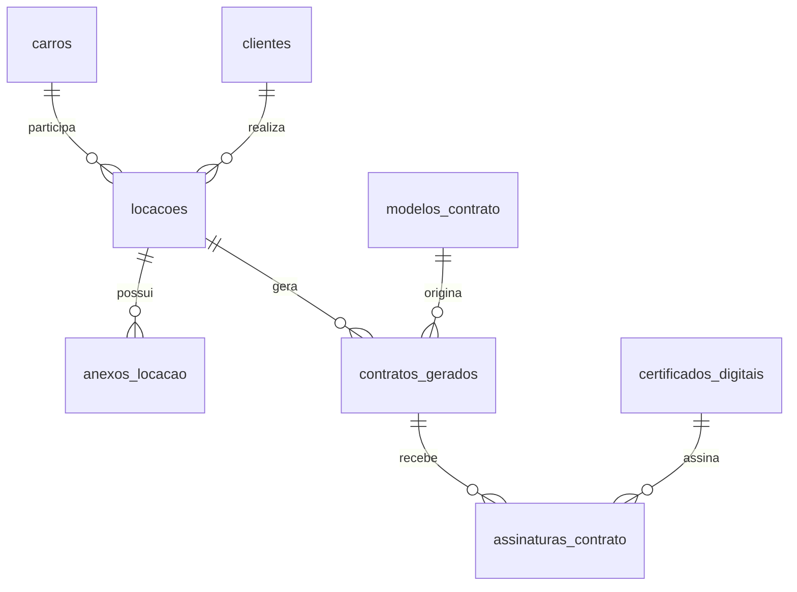

# Arquitetura do Alquiler Rent Car

## Plataforma multiempresa

O sistema pertence à empresa de soluções digitais e atende várias empresas clientes. Cada registro operacional recebe `empresa_id`. A empresa define seus usuários, módulos, papel timbrado, modelos de contrato, tipos de orçamento, recibos e certificados.

O acesso é apresentado como `CNPJ da empresa + usuário + senha`. A autenticação continua protegida pelo Supabase Auth e o perfil em `usuarios_empresa` informa o nome exibido no canto da tela e os módulos autorizados.

Dados iniciais:

- Empresa: **ALQUILER RENT A CAR LTDA**
- CNPJ: **54135275000161**
- Usuário inicial: **SAUGUSTO**
- Módulo ativo: **Locação**

### Identidade da plataforma

- Empresa desenvolvedora: **BG Soluções Tecnológicas**
- Sistema: **BG SYS**
- Administrador e desenvolvedor inicial: **STEPHANO AUGUSTO CHAVES COSTA**
- Usuário: **SAUGUSTO**

O mesmo usuário pode pertencer a várias empresas. Cada empresa pode possuir matriz e filiais e criar funções próprias, como gerente, atendente e financeiro. O administrador da plataforma pode prestar suporte com acesso auditado aos dados das empresas. A Alquiler terá inicialmente somente o módulo **Locação**.

Os próximos módulos previstos para outras empresas são **Oficina**, **Compras e estoque** e **Relatórios**.

## Organização funcional

### Cadastros

- **Clientes:** dados pessoais, contatos e documentos permanentes.
- **Fornecedores:** cadastro separado de clientes.
- **Carros:** frota, preço de diária, caução e situação operacional.
- **Certificados digitais:** certificados da própria locadora. Certificados A1 ficam em armazenamento privado; a senha nunca é salva.
- **Modelos de contrato:** documentos Word e marcadores reutilizáveis.

### Operação

- **Locações:** cliente, carro, período, diária, pagamentos e parcelamento da caução.
- **Contratos:** painel dos documentos gerados a partir das locações.
- **Contrato:** revisão de uma locação, geração do documento, versões, anexos e assinaturas.

## Fonte única dos dados

`locacoes` é a fonte da operação. A tabela antiga `contratos` não deve receber novos registros porque repete cliente, carro, datas e valores.

Cada documento gerado deve entrar em `contratos_gerados`. Assim, alterar ou substituir o carro não apaga uma versão já emitida.

## Ciclo de vida

### Locação

`Reservada → Ativa → Encerrada` ou `Cancelada`.

### Documento

`Rascunho → Gerado → Enviado → Assinado → Arquivado`.

### Assinaturas

Cada parte possui seu próprio estado. O documento passa para `Assinado` somente depois que todas as assinaturas exigidas forem concluídas.

## Decisão sobre assinatura

### Locadora

Pode assinar no servidor com certificado A1 da empresa. O backend baixa o certificado do bucket privado, usa a senha somente em memória e grava uma nova versão do PDF.

### Locatário

O fluxo padrão deve usar um provedor de assinatura remota com token e evidências, como documento com foto e selfie. Não é adequado guardar certificados pessoais dos clientes no sistema da locadora.

Se um locatário possuir certificado ICP-Brasil, a assinatura deve ocorrer em ambiente controlado pelo próprio titular ou por um provedor que suporte esse fluxo.

### A3

Certificados A3 exigem token ou cartão físico e interação local. Eles não funcionam no servidor web sem um agente instalado na máquina onde o dispositivo está conectado.

## Segurança

- Chave `service_role` somente no backend e em variável de ambiente.
- Senhas de certificado nunca entram no banco, arquivos ou logs.
- Buckets de contratos e certificados permanecem privados.
- Downloads usam URLs temporárias assinadas.
- Cada assinatura registra hash anterior e posterior, horário, usuário, IP, agente do navegador, papel e número de série do certificado.
- Contratos assinados ou arquivados ficam bloqueados para edição. Correções geram uma nova versão.

## Ordem de implementação

1. Consolidar as telas e remover o cadastro duplicado de contratos.
2. Criar tabelas de versões, assinaturas e anexos.
3. Gerar PDF e armazenar cada versão.
4. Assinar pela locadora com A1.
5. Validar assinaturas e bloquear documentos concluídos.
6. Integrar um provedor para assinatura remota do locatário.
7. Adicionar envio por e-mail ou WhatsApp e webhooks de atualização.
